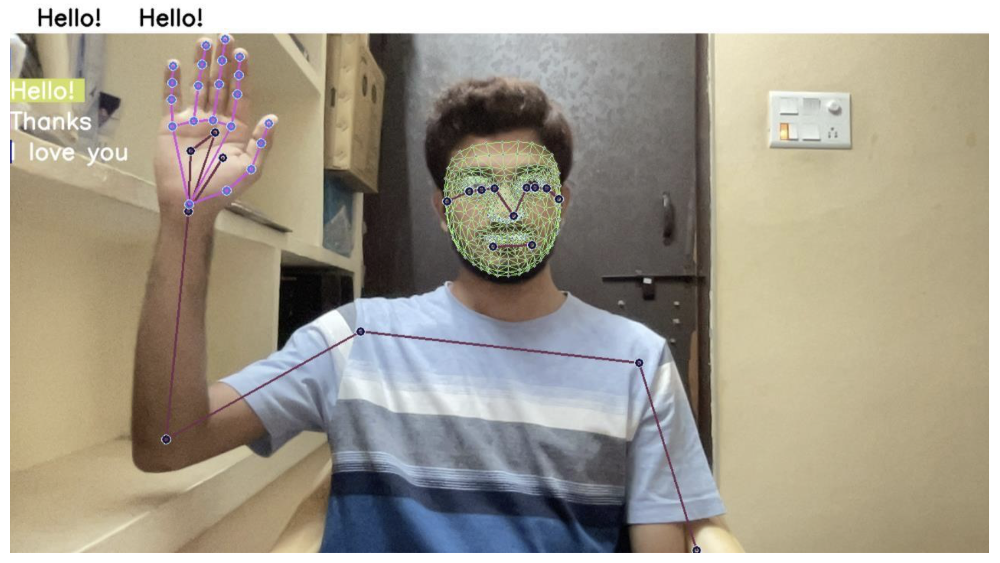
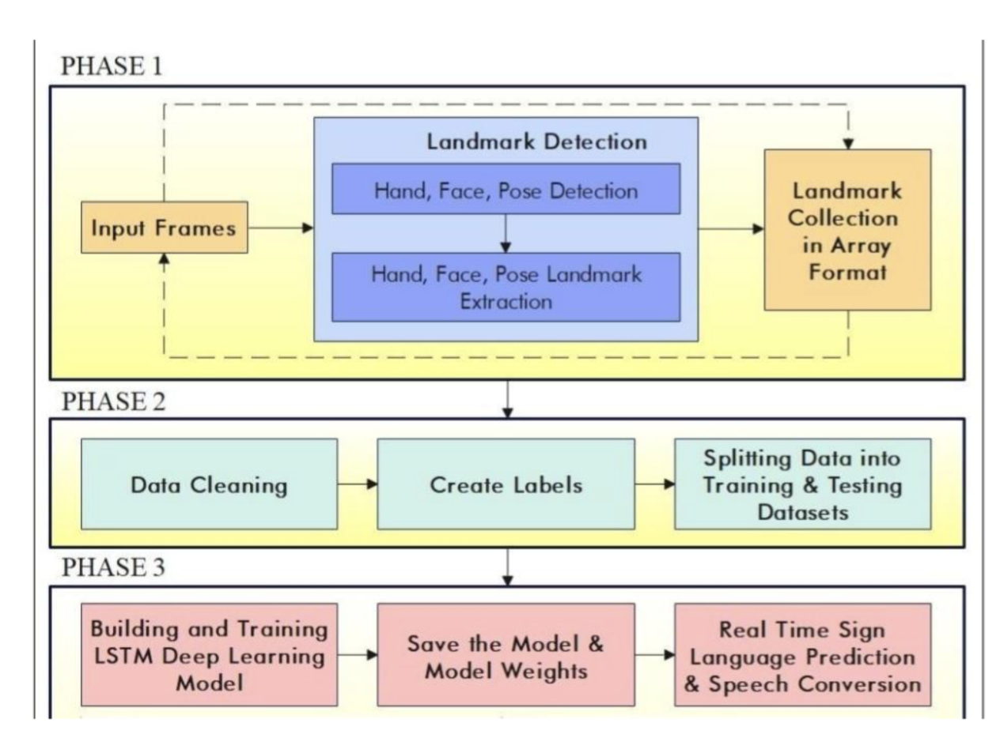
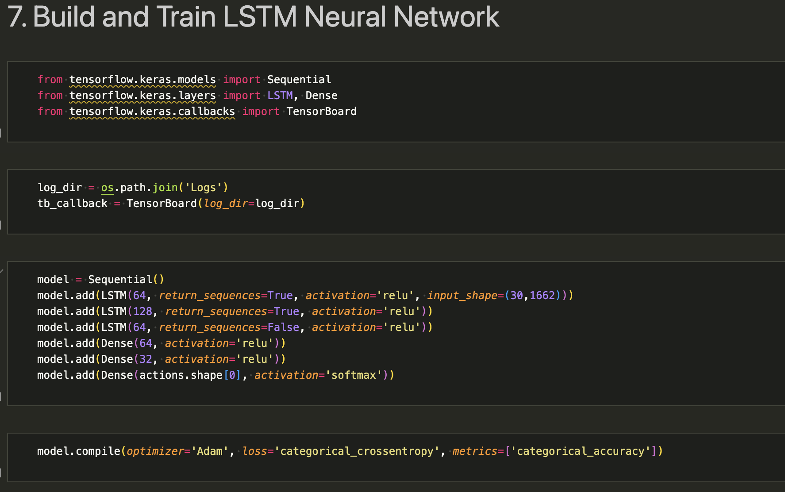
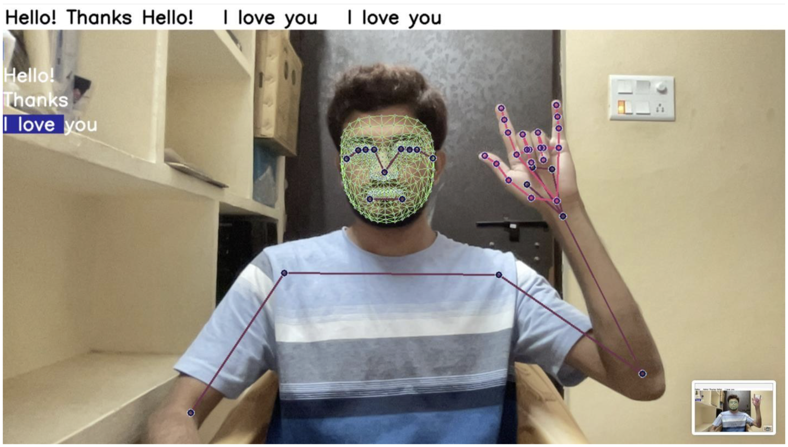

# American Sign Language Translator

Preview:

### Project Architecture

### Import and Install Dependencies

* Some very Important Libraries to have in your environment are:

            - opencv-python
            - numpy
            - matplotlib
            - mediapipe
            - tensorflow
            - scikit-learn

### Data Collection

* Collecting data is a crucial step in the recognition process, wherein gathered data is categorized into relevant vocabulary. Following this, preprocessing techniques are applied to extract essential features, which are then inputted into a deep learning classifier for sign recognition. 
* To create video input, it's essential to determine the set of gestures required for training and testing algorithms, selected based on deaf community jargon and culture. Video data is obtained from the system's built-in camera using the OpenCV library, with 30 video sequences captured for each gesture, and 30 frames extracted from each video.

### LSTM Neural Network

### Result

* Sentence Formation using LSTM networks

